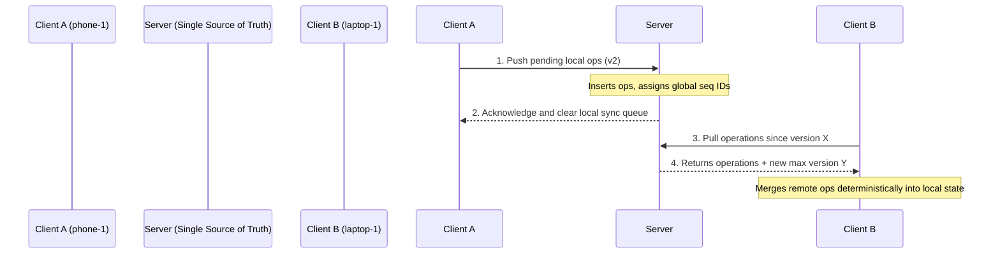

# Architectural Decisions & Proofs

This document details the data model, synchronization protocol, conflict resolution guarantees, and idempotency designs of the Offline-First Study Sync App.

---

## 1. Data Model

We separate data into two categories:
1. **The Source of Truth (Operation Log)**: An append-only log of granular mutations. Each entry is called an `Operation`.
2. **Materialized State (Read Views)**: Compact tables (`tasks`, `sessions`) representing the current cumulative state. Read views are updated by replaying/applying operations in a deterministic order.

### Why not sync materialized tables directly?
Syncing materialized rows directly (e.g. sending the whole `tasks` table) leads to severe conflicts like overwriting other fields, losing concurrent edits, and double-triggering events. By syncing the operation log, we replicate intent (e.g. `UPDATE_TASK` with `{ status: "DONE" }`) which allows for merging.

---

## 2. Sync Algorithm

Our sync algorithm uses a **Server-Sequenced Log Replication** model:



### Protocol Steps:
1. **Push**:
   * The client gathers all operations in its local log that haven't been successfully pushed yet (checked via the `sync_queue`).
   * The client sends them to `POST /sync/push`.
   * The server saves them using `INSERT OR IGNORE`. If they are new, the server appends them to its global operation log, giving them a sequential auto-incrementing integer `id`.
   * The client removes the successful operations from its `sync_queue`.
2. **Pull**:
   * The client requests all operations from the server since its last pulled version: `GET /sync/pull?sinceVersion=X`.
   * The server queries `operations WHERE id > X ORDER BY id ASC`.
   * The server returns this list along with the current maximum global index `Y`.
   * The client applies these operations and stores `Y` as its new `lastSyncedVersion`.

---

## 3. Conflict Resolution & Convergence Guarantee

### Convergence Proof:
For any two distributed nodes (e.g., Device A and Device B) to converge to the exact same materialized state, two properties must hold:
1. **State Replication**: They must eventually receive the exact same set of operations.
2. **Deterministic Merge**: They must apply the set of operations in the exact same logical order, regardless of the order they were received or executed.

### Operation Sorting Rule:
We achieve a deterministic merge order by sorting all incoming operations before applying them. The sort order is defined by a composite key:
$$\text{Order} = (\text{version}, \text{clientTimestamp}, \text{deviceId})$$

1. **Logical version** (Primary key): Incremented locally on the device for that specific entity. This preserves causal order (version 2 always succeeds version 1).
2. **Client Timestamp** (Secondary key): Wall-clock time of execution.
3. **Device ID** (Tertiary key): Lexicographical tie-breaker (e.g. `phone-1` < `laptop-1`).

Since the sorting algorithm is purely deterministic and uses fields immutable to the operation, **any device running this sorting algorithm over the same operations will produce the identical applied sequence, guaranteeing 100% convergence.**

### Delete vs Update Conflicts:
We handle delete vs update conflicts using **Tombstones**:
* A deleted task is not deleted from the database. It is updated with `deleted = 1` and its version is incremented.
* Because a delete is just another operation in the log with a version number, it resolves using the same $(\text{version}, \text{clientTimestamp}, \text{deviceId})$ rule.
* If a delete has a higher version than an update, the delete wins, and the item remains hidden. If an update has a higher version (e.g., someone undeletes or edits the task on another device subsequently), the update wins.

---

## 4. Idempotency & Exactly-Once Semantics

Offline networks are flaky, meaning sync messages will be retried, duplicated, and arrive out-of-order. We enforce strict idempotency at multiple levels.

### A. Duplicate Rewards Prevention
When a focus session is successfully completed, the user is awarded coins (+50) and their streak increases.
To prevent duplicate rewards from multiple sync attempts or multi-device pulls:
1. **Session UUID**: Every focus session is created with a stable, random UUID `id` generated by the client at the start of the timer.
2. **Processed Registry**: The server database contains a `processed_rewards` table.
3. **Execution Lock**: When the backend receives a session operation with status `completed`, it attempts to insert the session `id` into `processed_rewards`.
   * Since `processed_rewards.sessionId` is a Primary Key, the database enforces uniqueness.
   * If the insert succeeds, the backend processes the rewards (adds coins and logs streak) and triggers n8n.
   * If the insert fails (violates unique key), the backend ignores the reward processing, preventing double-rewards.

---

### B. Exactly-Once n8n Notifications
The n8n workflow must send a message only once per focus session.
Since the backend might call the n8n webhook multiple times (e.g., if n8n times out but succeeded, or during server push retries), n8n itself implements an idempotency lock:

```mermaid
graph TD
    A[n8n Webhook Triggered] --> B[GET /api/notifications/status?sessionId=...]
    B --> C{Already Sent?}
    C -- Yes --> D[Stop and Log: Deduplicated]
    C -- No --> E[POST /webhooks/notification-receive]
    E --> F[POST /api/notifications/status {sent: true}]
    F --> G[End]
```

1. When n8n receives a webhook trigger, it first queries the backend `GET /api/notifications/status?sessionId=...`.
2. If the response reports `sent: true`, the workflow stops immediately (no-op node).
3. If it reports `sent: false`, the workflow proceeds to trigger the notification (`POST /webhooks/notification-receive`) and immediately calls `POST /api/notifications/status` with `{ sessionId, sent: true }` to lock the session.
4. This ensures that even if n8n is triggered multiple times for the same session, the notification is sent exactly once.

---

## 5. Tradeoffs Made

1. **Local-First Event Log Size vs Storage**:
   * *Tradeoff*: We store all operation logs in the database. As the app runs for months, the log size will grow.
   * *Decision*: For a study application, the write volume is very low (a few focus sessions and task toggles per day). The log size remains small (a few megabytes after years). We chose durability and absolute convergence over log compaction complexity.
2. **Wall-Clock Clock Skew**:
   * *Tradeoff*: We use `clientTimestamp` as a tie-breaker when versions are equal. If a user's phone clock is set incorrectly (e.g., set to 1 hour in the past), their offline edits might be merged in the wrong order relative to actual wall time.
   * *Decision*: To eliminate this completely, we would need vector clocks or server-assigned wall clock coordinate sorting, which complicates local-first offline writes (clients wouldn't be able to sort concurrent updates until talking to the server). We accepted this minor skew trade-off as standard for distributed client apps.
